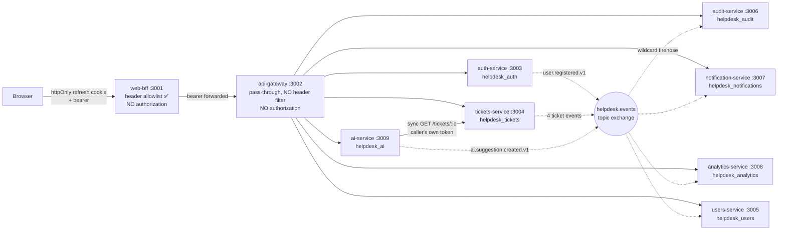

# Tenancy — current state

Status: **Audit finding** (Sprint 9.1). This describes the system as it is on
`43d4593`, with file and line references for every claim. The proposed
destination is in `tenancy-target-state.md`.

## The short version

The application is single-tenant, and completely so. A case-insensitive grep
for `tenant|organization|organisation|orgId|workspace` across every
`apps/*/src`, `apps/*/prisma` and `libs/*/src` returns **zero matches**. The
only hits anywhere are a free-text "organization" field on the marketing
contact form and a static array of role descriptions in public copy.

There is no partial scaffolding to reconcile — and equally, no existing type,
constraint or test will fail when tenant scoping is forgotten.

## Services, data and trust boundaries



**Every authorization decision happens inside a service's use case.** Neither
the BFF nor the gateway makes one. The trust boundary is the
`JwtAccessGuard`, which verifies a signature and attaches claims
(`libs/security/src/lib/jwt-access.guard.ts:33`) — it performs no role check
at all.

## Identity

| Fact                                           | Evidence                                                                     |
| ---------------------------------------------- | ---------------------------------------------------------------------------- |
| Six columns, no scope of any kind              | `apps/auth-service/prisma/schema.prisma:18`                                  |
| Roles are a bare `String[]` on the user row    | same file, line 22                                                           |
| Email is globally unique                       | `migrations/20260728040346_init/migration.sql:27`                            |
| Email is the only login identifier             | `application/use-cases/login.ts:21`                                          |
| Registration hardcodes `roles: ['user']`       | `use-cases/register-user.ts:42`                                              |
| **No role can be changed through the product** | `PrismaUserRepository` has `findByEmail`, `findById`, `create` — no `update` |

The last one is not a gap in my search; the public site says it out loud:
_"assigned outside the product — there is no administration UI"_
(`apps/web/src/app/(public)/how-it-works/page.tsx:207`). Roles are changed by
direct SQL.

**The access token is the entire authorization context.** One signing site,
`infrastructure/security/jwt-token-issuer.ts:21`, producing
`sub, email, roles, iat, exp, iss`. No `jti`, no session id, no scope. Every
consuming service registers `JwtModule` with the secret only — **no issuer
check and no algorithm allowlist anywhere**, and one symmetric secret shared
by all of them.

## Authorization, in full

Eleven checks, each a single boolean with no resource scope:

```ts
// libs/security/src/lib/actor.ts:7-20
interface Actor {
  readonly id: string;
  readonly roles: string[];
}
isStaff = roles.includes('agent') || roles.includes('admin');
isAdmin = roles.includes('admin');
```

**`isStaff` is defined four times.** The shared copy; a byte-identical local
copy in `apps/tickets-service/src/domain/ticket.ts:70`; another in
`apps/users-service/src/domain/user-profile.ts:35`; and a fourth inline in
the browser at `apps/web/src/app/(app)/tickets/[id]/page.tsx:81`. The
library's own header comment concedes the duplication. A change to
`libs/security` reaches five of eight consumers — and misses the two services
holding the most sensitive data.

Ticket visibility is one function:

```ts
// apps/tickets-service/src/domain/ticket.ts:75
canView = isStaff(actor) || ticket.requesterId === actor.id;
```

Any `agent` or `admin` sees every ticket in the database. `assigneeId` is
never consulted for visibility. `admin` is never distinguished from `agent`
anywhere in the ticket domain.

## The repository layer is scope-blind

This is the audit's central structural finding. Of seven methods on the
tickets repository port, **six take an id with no owner, actor or scope**:

| Method                                   | Evidence                        | Note                                                         |
| ---------------------------------------- | ------------------------------- | ------------------------------------------------------------ |
| `findById(id)`                           | `ports/ticket.repository.ts:37` | `findUnique({ where: { id } })` — PK lookup, no predicate    |
| `commentsFor(ticketId, includeInternal)` | line 45                         | visibility delegated to a **boolean argument**               |
| `historyFor(ticketId)`                   | line 49                         | cannot filter even if a caller wanted it to                  |
| `update(ticket, history)`                | adapter line 72                 | write predicate is `where: { id }` only                      |
| `create` / `addComment`                  | adapter 43, 91                  | no scope                                                     |
| `list(filter)`                           | line 21                         | **the only scopable method — and `requesterId` is optional** |

Every scope decision is made in the use case, _after_ an unscoped `findById`
has already returned the row. The pattern is uniform and correct today — four
of five use cases pair `findById` with `canView` — but **there is no defence
in depth.** A forgotten `canView` is full cross-user access with nothing
beneath it, and one such omission already exists:
`AssignTicketUseCase` (`use-cases/ticket-lifecycle.ts:79`) checks `isStaff`
and existence, never `canView`.

`list` is the shape that worries me most:

```ts
// prisma-ticket.repository.ts:56
...(filter.requesterId ? { requesterId: filter.requesterId } : {})
```

The single scoping mechanism in the repository is **opt-in and fails open.**
Omit the field, get everything.

## Two real problems that exist today, before any tenancy

**Internal-note existence leaks to requesters.** Every internal note writes a
history row with `detail: 'internal'` and the staff author's id
(`use-cases/add-comment.ts:54`). `GetTicketUseCase` then calls
`historyFor(ticketId)` unfiltered (`ticket-queries.ts:34`). A requester
therefore sees that internal notes exist, when, and who wrote them — the body
is hidden, the existence is not. This contradicts the service's own stated
rule (`domain/ticket.ts:47`: internal notes are _"visible to staff only,
never to the requester"_), and notification-service deliberately suppresses
the same signal (`if (input.internal) return null`). Two services disagree
about whether this is a secret.

**Assignment validates nothing.** `AssignTicketUseCase` accepts any
syntactically valid UUID (`dto.ts:53`) and never checks the assignee exists,
is a real user, or is staff.

## Cross-cutting channels

**The event envelope has no tenant field** — five fields, `id, type,
occurredAt, correlationId?, payload` (`libs/messaging/src/lib/contracts.ts:27`),
and none of the six contracts carries a discriminator either. One durable
topic exchange, four queues with no tenant segment, routing key = event type.

**audit-service binds `#` and stores payloads verbatim.** Two contracts put
substantive content into that globally-readable table: `user.registered.v1`
carries **email**, `ticket.created.v1` carries the ticket **title**. Reads are
gated on `isAdmin(actor)` and the actor **never reaches the WHERE clause** —
`this.events.list(filter)` where filter is `{type?, limit, offset}`. `limit`
is capped at 100 with an explicit anti-exfiltration comment; **`offset` has no
upper bound.**

**analytics-service is the hardest surface.** Its repository methods
`total()`, `countByStatus()`, `countByPriority()` take **zero arguments** —
there is no signature into which a tenant predicate can be threaded.
`createdPerDaySince` loads every matching row into Node and buckets in JS.

**notification-service is the counter-example.** Reads scope on `actor.id`
from the verified token, which is strictly narrower than tenant scoping and
safe by construction. Its risk is on the write side: `assigneeId` is trusted
verbatim off the bus with no membership check.

**Redis is configured and connected to nothing.** A repo-wide grep for
`redis|6379|ioredis|cache-manager|CacheModule` returns zero hits in any
TypeScript file. There is no in-memory cache either. Caching is a clean slate.

**`correlationId` is dead in production.** The envelope field exists; no
production publisher passes it. Every audit row stores null, so an audit row
cannot be joined back to the request that caused it.

**Logs carry no user and no tenant** — service, environment, requestId,
traceId, method, url, status, and nothing else.

## Headers: where a tenant could and could not be trusted

| Layer       | Behaviour                                                                                                   | Evidence                                      |
| ----------- | ----------------------------------------------------------------------------------------------------------- | --------------------------------------------- |
| web-bff     | **Explicit four-header allowlist** — a genuine choke point                                                  | `gateway.client.ts:50`                        |
| api-gateway | **Forwards every header untouched.** No allowlist, no strip list                                            | `proxy/service-proxy.ts:29`                   |
| Services    | `authorization` is signature-verified; `x-request-id`/`x-trace-id` are adopted **verbatim and unvalidated** | `jwt-access.guard.ts:35`, `correlation.ts:37` |

The gateway is the decisive fact. A browser-set `x-organization-id` reaching
the gateway would be forwarded verbatim to a service that has exactly one
layer deciding access. This is why ADR 0014 puts tenancy in the signed token.

## Tests and fixtures

**Fixtures assume a single global world in the strongest sense: they
truncate.** Every integration suite calls unfiltered `deleteMany()` on every
table in `beforeEach` and `afterAll`. There is no shared fixture module —
each suite has inline builders using `randomUUID()`. There is **no seed data
and no demo data anywhere** in the repository.

tickets-service has exactly one integration spec. It pins requester filtering
and internal/public comment filtering — but **only via `total` counts**, never
asserting the foreign ticket is absent from `items`.

That produces the most dangerous property in this audit:

> A nullable `organizationId` changes nothing — all four tests pass unedited.
> A `NOT NULL` one breaks `create()` loudly and immediately. But adding
> `organizationId` as an **optional** field on `TicketListFilter` keeps the
> entire suite green while the `WHERE` clause spans every tenant, because the
> filter builds from optional spreads and no test asserts a query is scoped by
> anything other than `requesterId`.

The migration's most likely failure mode is silent, and the current test suite
would not catch it.

## Configuration that a tenancy scheme would collide with

- **`CORS_ALLOWED_ORIGINS`** is an exact-match array with no wildcard support,
  read once at boot (`libs/configuration/src/lib/env.ts:34`). Per-organization
  **subdomains break it**.
- **The refresh cookie is hard-coded to path `/session`**
  (`session.controller.ts:144`). Per-organization **path prefixes** would
  silently break session recovery.
- **`NEXT_PUBLIC_BFF_URL` is inlined at build time.** One built frontend can
  only ever talk to one BFF origin.
- **There is no `middleware.ts` and no layout-level route guard** in
  `apps/web`. There is no request-time hook where a tenant could be resolved
  from a hostname, and no single choke point in the frontend. `AuthProvider`
  (`components/auth-context.tsx:34`, mounted globally) is the only place a
  tenant context could live client-side.

## What the databases look like

Seven databases, twelve tables, enforced by credentials rather than
convention (ADR 0003). **Exactly three non-primary-key unique constraints
exist platform-wide:** `users(email)`, `user_profiles(email)`, and
`notifications(user_id, source_event_id)`.

The third survives tenancy untouched. So **only two constraints are in
question, and they are the same constraint expressed twice** — and they must
change together or the projection starts rejecting rows its source accepted.

**There is no ticket code, number or slug anywhere.** No per-tenant sequence
to design.

Ten of twelve tables need an organization reference; `users` and
`refresh_tokens` are global identity data.

One documentation drift found: `docs/architecture/data-ownership.md:44` says
the init script creates only the `auth_service` role. It creates all seven.
