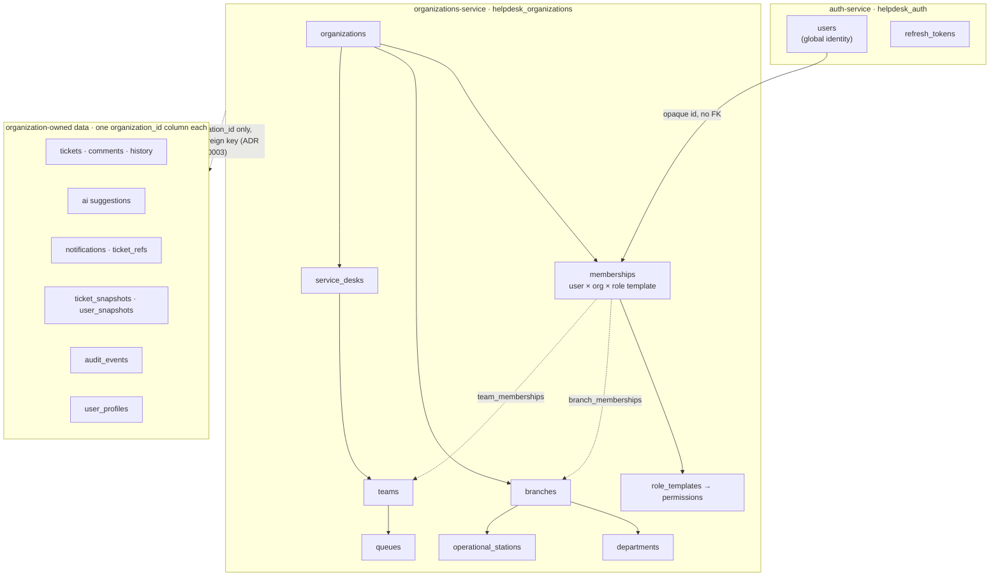
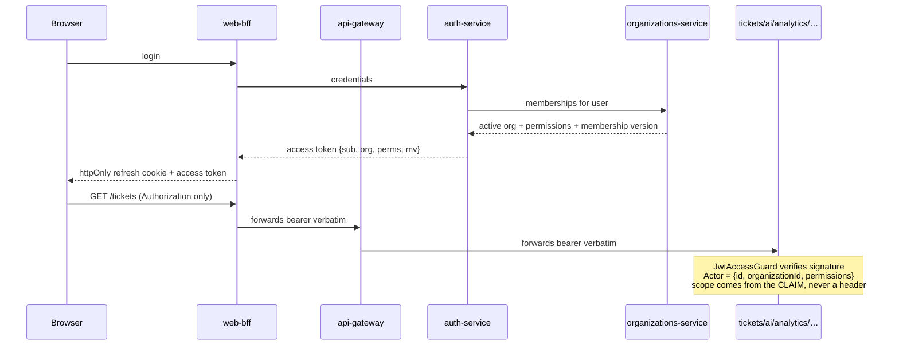

# Tenancy — target state

Status: **Approved 2026-07-30, first phases implemented.** This document
describes where the domain is going and why; the current system is described in
`tenancy-current-state.md`.

Every structural decision below is recorded in an ADR (0012–0017), all now
Accepted. Approved does not mean built. What exists after Sprint 9.2 is
organizations-service, its `organizations` and `memberships` tables, and the
`org`, `perms` and `mv` claims on the access token — which every service
receives and none reads. Everything else here is still a target: the rest of
the organizational graph (branches, departments, stations, service desks,
teams, queues), role templates as seeded rows with their permissions, the
`organization_id` column on organization-owned data, and every visibility rule
below. `tenancy-migration-plan.md` is the sequence that builds it and records
which phases have run.

## The shape



Two properties of that picture carry the whole design:

**The organizational graph lives in one database.** Every edge inside
`organizations-service` is a real foreign key with real referential
integrity. You can ask the database whether a branch belongs to the
organization a membership belongs to. That is only possible because the graph
was not split (ADR 0013).

**Everything outside it holds an opaque `organization_id`.** ADR 0003 forbids
cross-service foreign keys, so `tickets.organization_id` is a uuid the ticket
database cannot validate. That is accepted, and it is why the migration plan
verifies integrity with counts and queries rather than trusting constraints.

## What travels with a request



The organization is in the signed token and nowhere else. No service reads
tenancy from a header, because neither the gateway nor the BFF performs any
authorization and therefore neither can strip or validate one — a
browser-set `x-organization-id` would be forwarded verbatim to a service that
has exactly one layer deciding access. ADR 0014 works through that analysis.

## Role templates

Eight templates, mapping to permissions. Templates are seeded rows, not
hard-coded names, so custom roles later reuse the same evaluator.

| Template               | Scope        | In one line                                                    |
| ---------------------- | ------------ | -------------------------------------------------------------- |
| `PLATFORM_SUPER_ADMIN` | platform     | Operates the platform. **Never grantable by an organization.** |
| `ORGANIZATION_OWNER`   | organization | Owns the workspace, including billing and deletion             |
| `ORGANIZATION_ADMIN`   | organization | Configures people, structure and integrations                  |
| `BRANCH_MANAGER`       | branch set   | Runs one or more locations                                     |
| `SERVICE_DESK_MANAGER` | service desk | Runs a desk and its queues                                     |
| `TEAM_MANAGER`         | team         | Runs one team's workload                                       |
| `AGENT`                | team / queue | Resolves requests                                              |
| `REQUESTER`            | self         | Asks for help, follows their own requests                      |
| `AUDITOR`              | organization | Reads the trail and analytics; changes nothing                 |

## Permission matrix

**Approved 2026-07-30.** It was drafted from inferred product intent and
reviewed as a whole; the four judgement calls flagged below were confirmed
rather than changed. It stays the part of this document most likely to need
revision once real organizations use it — a permission that turns out wrong
is a row edit plus a test, not a redesign.

`●` granted · `○` granted for own scope only · blank not granted

| Permission                         | OWNER | ORG_ADMIN | BRANCH_MGR | DESK_MGR | TEAM_MGR | AGENT | REQUESTER | AUDITOR |
| ---------------------------------- | :---: | :-------: | :--------: | :------: | :------: | :---: | :-------: | :-----: |
| `organization.read`                |   ●   |     ●     |     ●      |    ●     |    ●     |   ●   |     ●     |    ●    |
| `organization.update`              |   ●   |     ●     |            |          |          |       |           |         |
| `organization.delete`              |   ●   |           |            |          |          |       |           |         |
| `organization.manage_security`     |   ●   |     ●     |            |          |          |       |           |         |
| `organization.manage_integrations` |   ●   |     ●     |            |          |          |       |           |         |
| `people.read`                      |   ●   |     ●     |     ○      |    ○     |    ○     |   ○   |           |    ●    |
| `people.invite`                    |   ●   |     ●     |     ○      |          |          |       |           |         |
| `people.create`                    |   ●   |     ●     |            |          |          |       |           |         |
| `people.update`                    |   ●   |     ●     |     ○      |          |          |       |           |         |
| `people.suspend`                   |   ●   |     ●     |            |          |          |       |           |         |
| `people.assign_roles`              |   ●   |     ●     |            |          |          |       |           |         |
| `people.import`                    |   ●   |     ●     |            |          |          |       |           |         |
| `branches.read`                    |   ●   |     ●     |     ○      |    ●     |    ●     |   ●   |           |    ●    |
| `branches.create`                  |   ●   |     ●     |            |          |          |       |           |         |
| `branches.update`                  |   ●   |     ●     |     ○      |          |          |       |           |         |
| `branches.manage_members`          |   ●   |     ●     |     ○      |          |          |       |           |         |
| `tickets.create`                   |   ●   |     ●     |     ●      |    ●     |    ●     |   ●   |     ●     |         |
| `tickets.read_own`                 |   ●   |     ●     |     ●      |    ●     |    ●     |   ●   |     ●     |    ●    |
| `tickets.read_branch`              |   ●   |     ●     |     ○      |          |          |       |           |    ●    |
| `tickets.read_team`                |   ●   |     ●     |            |    ●     |    ●     |   ●   |           |    ●    |
| `tickets.read_all`                 |   ●   |     ●     |            |          |          |       |           |    ●    |
| `tickets.assign_self`              |   ●   |     ●     |     ●      |    ●     |    ●     |   ●   |           |         |
| `tickets.assign_agent`             |   ●   |     ●     |     ○      |    ●     |    ●     |       |           |         |
| `tickets.reply_public`             |   ●   |     ●     |     ●      |    ●     |    ●     |   ●   |     ○     |         |
| `tickets.note_internal`            |   ●   |     ●     |     ●      |    ●     |    ●     |   ●   |           |         |
| `tickets.change_status`            |   ●   |     ●     |     ●      |    ●     |    ●     |   ●   |     ○     |         |
| `tickets.change_priority`          |   ●   |     ●     |     ●      |    ●     |    ●     |   ●   |           |         |
| `tickets.escalate`                 |   ●   |     ●     |     ●      |    ●     |    ●     |   ●   |           |         |
| `teams.manage`                     |   ●   |     ●     |            |    ●     |    ○     |       |           |         |
| `queues.manage`                    |   ●   |     ●     |            |    ●     |          |       |           |         |
| `routing.manage`                   |   ●   |     ●     |            |    ●     |          |       |           |         |
| `ai.manage`                        |   ●   |     ●     |            |          |          |       |           |         |
| `audit.read`                       |   ●   |     ●     |            |          |          |       |           |    ●    |
| `analytics.read`                   |   ●   |     ●     |     ○      |    ○     |    ○     |       |           |    ●    |

Four things in that table are deliberate and worth challenging:

- **`REQUESTER` has `tickets.change_status` as own-scope only.** This
  preserves today's rule that a requester may close their own resolved ticket
  (`apps/tickets-service`), and nothing more.
- **`AUDITOR` reads everything and writes nothing.** Including `tickets.read_all`,
  which is a lot of trust; the alternative is an auditor who cannot verify what
  they are auditing.
- **`BRANCH_MANAGER` cannot `people.suspend`.** Confirmed on review.
  Suspension is an organization-level act with security consequences, and a
  branch manager who genuinely needs it can be given `ORGANIZATION_ADMIN` —
  which is a visible, audited grant rather than a quiet widening of what
  every branch manager can do. The retail case where the store manager is
  alone on site is real; the answer is a second role, not a broader one.
- **`AGENT` has no `people.invite`.** Deliberate: onboarding is an
  administrative act, not an operational one.

## Ticket visibility, resolved

Today: `isStaff(actor) || ticket.requesterId === actor.id`. Target:

```
1. ticket.organizationId === actor.organizationId    ← always, first, non-negotiable
2. then, whichever is granted:
   tickets.read_all     → any ticket in the organization
   tickets.read_branch  → ticket.branchId ∈ actor's branch set
   tickets.read_team    → ticket's queue/team ∈ actor's team set
   tickets.read_own     → ticket.requesterId === actor.id
```

Step 1 is a separate step on purpose. It is checked before any permission is
consulted, so a bug in permission evaluation cannot produce a cross-tenant
read — only an over-broad in-tenant one.

## Deliberately not in the target state

- **Custom per-tenant roles.** Templates cover every scenario in the brief.
  The tables support custom roles later without redesign.
- **Schema-per-tenant or database-per-tenant.** Rejected in ADR 0012.
- **A policy-enforcing gateway.** Rejected in ADR 0014; the token carries the
  context instead.
- **Billing, SSO, SCIM, WhatsApp.** Out of Block A entirely.
