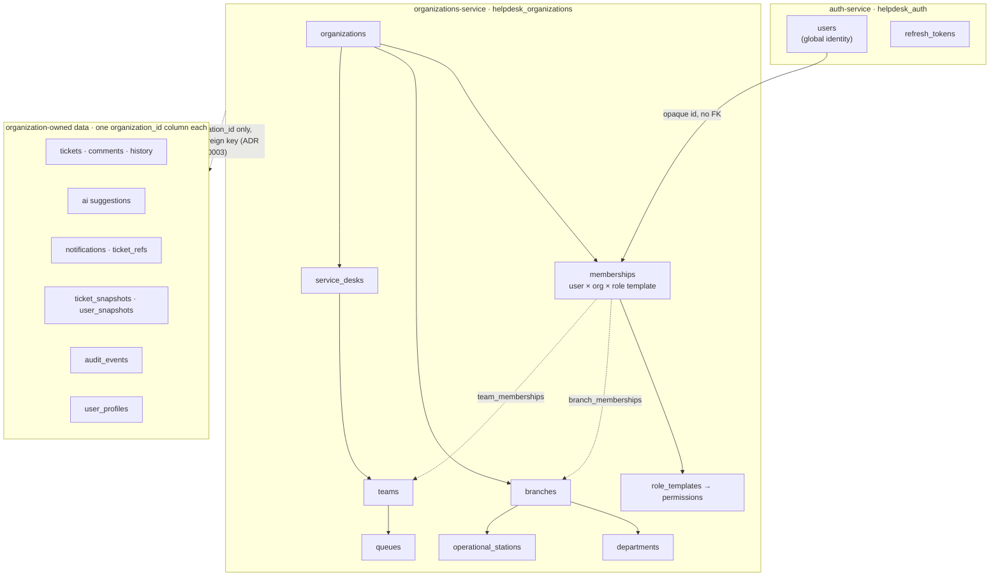
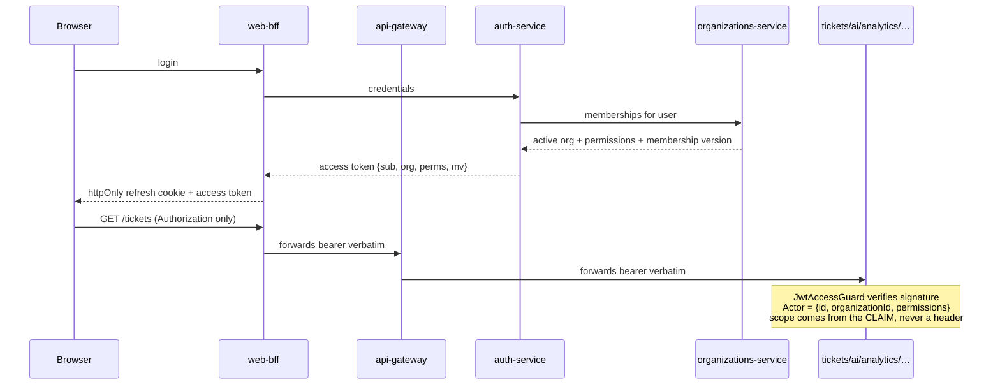

# Tenancy — target state

Status: **Approved 2026-07-30, phases 0–6 implemented.** This document
describes where the domain is going and why; the current system is described in
`tenancy-current-state.md` (a Sprint 9.1 audit snapshot — read it as history).

Every structural decision below is recorded in an ADR (0012–0017), all now
Accepted. As of Sprint 9.4 the core of this picture is real: the `org` and
`perms` claims are load-bearing (permissions resolve from the role template
through the code map ADR 0015's amendment describes), every organization-owned
table carries `organization_id`, reads require the tenant and writes take it
from the token, the consumers read the tenant-carrying event stream, and the
membership lifecycle exists with its events. Branches, departments and
operational stations arrived in 9.5 and 9.11, support teams in 9.12, and the
scoped ticket reads below are all implemented — `read_branch` since 9.5 and
`read_team` since 9.12, with `read_all` still granted to agents by a deliberate
interim widening.

**Seeded role-template rows are unblocked as of Sprint 9.14** and remain
unbuilt. They were deferred on the template-vocabulary question, which that
sprint settled: one spelling, a declared scope per template, and every `○` cell
classified. What is left is mechanism — a migration, a repository and an
evaluator read — not a decision.

Still a target: service desks and queues (`queues.manage` deliberately
unimplemented, see below), custom per-tenant roles, and seeded rows.
`NOT NULL` enforcement ran in phase 7. `tenancy-migration-plan.md` records
exactly which phases have run.

## The shape



Two properties of that picture carry the whole design:

**The organizational graph lives in one database.** Every edge inside
`organizations-service` is a real foreign key with real referential
integrity. You can ask the database whether a branch belongs to the
organization a membership belongs to. That is only possible because the graph
was not split (ADR 0013).

**Everything outside it holds an opaque `organization_id`.** ADR 0003 forbids
cross-service foreign keys, so `tickets.organization_id` is a uuid the ticket
database cannot validate. That is accepted, and it is why the migration plan
verifies integrity with counts and queries rather than trusting constraints.

## What travels with a request



The organization is in the signed token and nowhere else. No service reads
tenancy from a header, because neither the gateway nor the BFF performs any
authorization and therefore neither can strip or validate one — a
browser-set `x-organization-id` would be forwarded verbatim to a service that
has exactly one layer deciding access. ADR 0014 works through that analysis.

## Role templates

**The stable keys are the ones below, and they are the values stored in
`memberships.role_template`** (Sprint 9.14). This document previously wrote
them in `SCREAMING_SNAKE` while the matrix below abbreviated them, ADR 0015
spelled them as lowercase prose, and the code used snake_case — four
conventions for eight things. The code's spelling won because it is the only
one that is load-bearing: changing it is a data migration. The vocabulary now
lives in `libs/security` (`ROLE_TEMPLATE_SCOPES`), imported by
organizations-service and by the browser, so there is one list rather than
several that agree by coincidence.

**This table used to say "Eight templates" above nine rows.** The ninth was
`PLATFORM_SUPER_ADMIN`, and the contradiction was the platform/organization
distinction having nowhere to live. It has one now: every template declares a
scope, and `ORGANIZATION_GRANTABLE_TEMPLATES` is derived from it, so no
organization can grant a platform-scoped template — ADR 0015's first invariant
is a rule with a test instead of a property of an empty set.

Eight templates ship. Templates still map to permissions through a code map,
not seeded rows; see ADR 0015's amendment for why, and what changed about it.

| Key                    | Scope        | In one line                                        |
| ---------------------- | ------------ | -------------------------------------------------- |
| `owner`                | organization | Owns the workspace, including billing and deletion |
| `organization_admin`   | organization | Configures people, structure and integrations      |
| `branch_manager`       | organization | Runs one or more locations                         |
| `service_desk_manager` | organization | Runs the support teams and routes work             |
| `team_manager`         | organization | Runs one team's workload                           |
| `agent`                | organization | Resolves requests                                  |
| `requester`            | organization | Asks for help, follows their own requests          |
| `auditor`              | organization | Reads the trail and analytics; changes nothing     |

The **Scope** column is the template's own scope — where its authority comes
from — and is `organization` for all eight because an organization grants
them. It is deliberately NOT the reach of what they can see: a branch manager
is organization-scoped and sees a branch set, and that reach lives in the
permission keys (`tickets.read_branch`) and the token claims (`br`, `tm`).
Conflating the two is what produced the old "branch set" and "team / queue"
entries, which described reach in a column about grant authority.

**A platform-scoped template would be written `platform` here and would be
refused by every grant path automatically.** None ships, because a key with no
call site is a claim nothing can falsify — the same rule the permission
vocabulary follows.

## Permission matrix

**Approved 2026-07-30.** It was drafted from inferred product intent and
reviewed as a whole; the four judgement calls flagged below were confirmed
rather than changed. It stays the part of this document most likely to need
revision once real organizations use it — a permission that turns out wrong
is a row edit plus a test, not a redesign.

`●` granted · `○` granted for own scope only · blank not granted

**`○` is a notation for readers of this table, never something the evaluator
represents** (Sprint 9.14). ADR 0015 settled the underlying rule — "scope is
part of the permission, not a separate parameter", because a scope argument is
a thing a call site can forget to pass and a permission key is not — so an `○`
cell is never a qualifier on a grant. It is one of three things, and the
classification below says which, because seventeen cells that all looked
"pending" were what kept ADR 0015's seeded template rows blocked through four
sprints.

- **(a) Already a distinct key.** The own scope has its own permission and the
  cell is implemented. `tickets.read_own` beside `read_branch`, `read_team`
  and `read_all` is the pattern.
- **(b) Domain logic, not a grantable key.** The rule is about the actor's
  relationship to one row rather than about a capability. A requester closing
  their own resolved ticket is decided in the ticket domain, and inventing
  `tickets.change_status_own` would move a business rule into a token.
- **(c) Deferred, with the feature that would check it.** No call site exists,
  so no key exists. Named here rather than left as an open question.

| Cell                                   | Class | Note                                                                               |
| -------------------------------------- | :---: | ---------------------------------------------------------------------------------- |
| `people.read` — BRANCH/DESK/TEAM/AGENT |  (c)  | DESK_MGR resolved in 9.14 as `people.read_assignable`; the other three hold none   |
| `people.invite` — BRANCH_MGR           |  (c)  | Needs a branch set on the invitation — the COLUMN arrived in 9.15, the key has not |
| `people.update` — BRANCH_MGR           |  (c)  | Needs branch-scoped editing to mean something                                      |
| `branches.read` — BRANCH_MGR           |  (c)  | The `br` claim already narrows what they see; no separate key yet                  |
| `branches.update` — BRANCH_MGR         |  (c)  | Editing only their own branches; no call site                                      |
| `branches.manage_members` — BRANCH_MGR |  (c)  | Same shape as the row above                                                        |
| `tickets.read_branch` — BRANCH_MGR     |  (a)  | The key IS the own scope; the `br` claim carries which branches                    |
| `tickets.assign_agent` — BRANCH_MGR    |  (c)  | Would mean "within my branches"; nothing enforces that yet                         |
| `tickets.reply_public` — REQUESTER     |  (b)  | Replying on your own ticket; decided in the ticket domain                          |
| `tickets.change_status` — REQUESTER    |  (b)  | Closing your own resolved ticket; decided in the ticket domain                     |
| `teams.manage` — TEAM_MGR              |  (c)  | Their own team only; the surface administers teams organization-wide               |
| `analytics.read` — BRANCH/DESK/TEAM    |  (c)  | No analytics UI ships, so no scoped read has a caller                              |

Twelve rows, seventeen cells. **Nothing in class (c) blocks seeded template
rows any more**: a deferred cell is simply a permission the template does not
hold, which a row can express perfectly well as its absence.

| Permission                         | OWNER | ORG_ADMIN | BRANCH_MGR | DESK_MGR | TEAM_MGR | AGENT | REQUESTER | AUDITOR |
| ---------------------------------- | :---: | :-------: | :--------: | :------: | :------: | :---: | :-------: | :-----: |
| `organization.read`                |   ●   |     ●     |     ●      |    ●     |    ●     |   ●   |     ●     |    ●    |
| `organization.update`              |   ●   |     ●     |            |          |          |       |           |         |
| `organization.delete`              |   ●   |           |            |          |          |       |           |         |
| `organization.manage_security`     |   ●   |     ●     |            |          |          |       |           |         |
| `organization.manage_integrations` |   ●   |     ●     |            |          |          |       |           |         |
| `people.read`                      |   ●   |     ●     |     ○      |    ○     |    ○     |   ○   |           |    ●    |
| `people.invite`                    |   ●   |     ●     |     ○      |          |          |       |           |         |
| `people.create`                    |   ●   |     ●     |            |          |          |       |           |         |
| `people.update`                    |   ●   |     ●     |     ○      |          |          |       |           |         |
| `people.suspend`                   |   ●   |     ●     |            |          |          |       |           |         |
| `people.assign_roles`              |   ●   |     ●     |            |          |          |       |           |         |
| `people.import`                    |   ●   |     ●     |            |          |          |       |           |         |
| `branches.read`                    |   ●   |     ●     |     ○      |    ●     |    ●     |   ●   |           |    ●    |
| `branches.create`                  |   ●   |     ●     |            |          |          |       |           |         |
| `branches.update`                  |   ●   |     ●     |     ○      |          |          |       |           |         |
| `branches.manage_members`          |   ●   |     ●     |     ○      |          |          |       |           |         |
| `tickets.create`                   |   ●   |     ●     |     ●      |    ●     |    ●     |   ●   |     ●     |         |
| `tickets.read_own`                 |   ●   |     ●     |     ●      |    ●     |    ●     |   ●   |     ●     |    ●    |
| `tickets.read_branch`              |   ●   |     ●     |     ○      |          |          |       |           |    ●    |
| `tickets.read_team`                |   ●   |     ●     |            |    ●     |    ●     |   ●   |           |    ●    |
| `tickets.read_all`                 |   ●   |     ●     |            |          |          |       |           |    ●    |
| `tickets.assign_self`              |   ●   |     ●     |     ●      |    ●     |    ●     |   ●   |           |         |
| `tickets.assign_agent`             |   ●   |     ●     |     ○      |    ●     |    ●     |       |           |         |
| `tickets.reply_public`             |   ●   |     ●     |     ●      |    ●     |    ●     |   ●   |     ○     |         |
| `tickets.note_internal`            |   ●   |     ●     |     ●      |    ●     |    ●     |   ●   |           |         |
| `tickets.change_status`            |   ●   |     ●     |     ●      |    ●     |    ●     |   ●   |     ○     |         |
| `tickets.change_priority`          |   ●   |     ●     |     ●      |    ●     |    ●     |   ●   |           |         |
| `tickets.escalate`                 |   ●   |     ●     |     ●      |    ●     |    ●     |   ●   |           |         |
| `teams.manage`                     |   ●   |     ●     |            |    ●     |    ○     |       |           |         |
| `queues.manage`                    |   ●   |     ●     |            |    ●     |          |       |           |         |
| `routing.manage`                   |   ●   |     ●     |            |    ●     |          |       |           |         |
| `ai.manage`                        |   ●   |     ●     |            |          |          |       |           |         |
| `audit.read`                       |   ●   |     ●     |            |          |          |       |           |    ●    |
| `analytics.read`                   |   ●   |     ●     |     ○      |    ○     |    ○     |       |           |    ●    |

**`tickets.read_team` and `teams.manage` key on SUPPORT TEAMS, which are not
departments.** Sprint 9.12 introduced them as a separate concept
(**ADR 0022**): a department is the requester's organizational area and stays
branch-scoped, while a support team is the operational group that resolves a
ticket and is organization-owned, with an explicit team→branch scope
relationship. A team with no scope rows serves the whole organization; a team
with rows serves those branches. `tickets.read_team` derives from active
support-team membership and from nothing else — belonging to a department
grants no support visibility. `queues.manage` stays unimplemented on purpose:
a queue would have to say what it is that a team is not.

**`people.import` got its first call site in Sprint 9.15**, granted exactly as
this table has it — owner and organization_admin, nobody else. It is separate
from `people.invite` because the acts differ in blast radius rather than in
kind: one wrong choice in a spreadsheet repeats over every row of it. At row
level it grants nothing extra, because an import issues invitations and each
one is bounded by the same ceiling a single invitation is.

**`people.create` stays unimplemented, and an import is not it.** The row above
is the admin-creates-an-account key, which ADR 0016 decided against: there is
no placeholder password hash, so the administrator creates ACCESS and the
person creates the account. A CSV import of two hundred people produces two
hundred invitations, not two hundred accounts, and the distinction is the
reason the screen says the platform sends nothing.

**Sprint 9.13 gave `service_desk_manager` two more keys; Sprint 9.14 narrowed
one of them.** `branches.read` is theirs by this matrix and finally had a call
site: a team's reach is a set of branches, and the coverage editor cannot name
a branch it may not read. The other was flat `people.read`, granted as an
interim widening of their `○` cell so the team member picker would have names
in it — and it lasted exactly one sprint. The scope qualifier turned out not to
be the answer, because a picker exists to add somebody who is NOT in the team
yet and so cannot work from own scope at all. **`people.read_assignable`** is
the answer: active members as an identifier, a name and an email, and nothing
else. That template now names candidates and reaches neither the directory, nor
`GET /users/:userId`, nor the People screen, nor anybody's role, status or
phone — and it still cannot invite, suspend, assign roles, or create or edit a
branch.

The new key is not in the table above because it is not in the approved matrix:
it is narrower than every cell there, and it exists so that a `○` cell could be
honoured rather than widened. When this matrix is next revised it should gain a
`people.read_assignable` row with `●` for DESK_MGR.

**Sprint 10.5 gave two more rows of this table their first call sites, and
deliberately added no row of its own.** `organization.read` had been granted by
every template since the permission migration and checked by nothing;
`GET /organizations/current` is the first place the platform actually asks for
it. `organization.update` gained a second call site — the organization's own
display name — beside users-service's profile-field definitions, granted
exactly as this table has it.

**Choosing an organization has no permission key either, and for a different
reason** (Sprint 10.6, ADR 0025). `GET /organizations/mine` and the token
exchange are both keyless: a key gating them would have to be one every
template holds, which is not a key, and both are deliberately TENANTLESS
because they exist for the states a tenant claim cannot describe — belonging
nowhere, or leaving the organization your token names. The listing is the
platform's first deliberately cross-tenant read; it is scoped by the caller's
own membership set instead, and returns nothing they could not already read.

**Transferring ownership has no permission key, and should not get one**
(ADR 0024). It is authorized by reading the actor's stored membership and
requiring `owner` there. Three reasons, and the third is the one that decides
it: this table has no such row; a key would have to be granted to `owner` alone,
which means splitting it from `organization_admin` in the permission map to
express something a column already says; and the check has to read the row
regardless, because a token outlives a demotion by
`JWT_ACCESS_TTL_SECONDS` — so a key beside it would only be a second answer
that can disagree, and the staler of the two. `organization.delete` and the
billing keys stay unimplemented and are the reason owner and admin still resolve
alike.

Four things in that table are deliberate and worth challenging:

- **`REQUESTER` has `tickets.change_status` as own-scope only.** This
  preserves today's rule that a requester may close their own resolved ticket
  (`apps/tickets-service`), and nothing more.
- **`AUDITOR` reads everything and writes nothing.** Including `tickets.read_all`,
  which is a lot of trust; the alternative is an auditor who cannot verify what
  they are auditing.
- **`BRANCH_MANAGER` cannot `people.suspend`.** Confirmed on review.
  Suspension is an organization-level act with security consequences, and a
  branch manager who genuinely needs it can be given `ORGANIZATION_ADMIN` —
  which is a visible, audited grant rather than a quiet widening of what
  every branch manager can do. The retail case where the store manager is
  alone on site is real; the answer is a second role, not a broader one.
- **`AGENT` has no `people.invite`.** Deliberate: onboarding is an
  administrative act, not an operational one.

## Ticket visibility, resolved

Today: `isStaff(actor) || ticket.requesterId === actor.id`. Target:

```
1. ticket.organizationId === actor.organizationId    ← always, first, non-negotiable
2. then, whichever is granted:
   tickets.read_all     → any ticket in the organization
   tickets.read_branch  → ticket.branchId ∈ actor's branch set
   tickets.read_team    → ticket's queue/team ∈ actor's team set
   tickets.read_own     → ticket.requesterId === actor.id
```

Step 1 is a separate step on purpose. It is checked before any permission is
consulted, so a bug in permission evaluation cannot produce a cross-tenant
read — only an over-broad in-tenant one.

## Deliberately not in the target state

- **Custom per-tenant roles.** Templates cover every scenario in the brief.
  The tables support custom roles later without redesign.
- **Schema-per-tenant or database-per-tenant.** Rejected in ADR 0012.
- **A policy-enforcing gateway.** Rejected in ADR 0014; the token carries the
  context instead.
- **Billing, SSO, SCIM, WhatsApp.** Out of Block A entirely.
